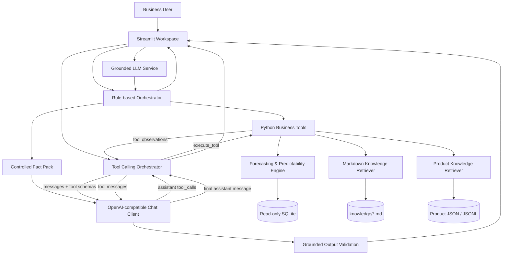

<div align="center">

# Sales Forecasting Agent

**LLM-powered Sales Forecasting & Business Analysis Workspace**

面向零售动销场景的 AI 分析系统：让确定性的预测引擎负责计算，让 Agent 理解问题、选择工具、检索知识，并生成可追溯的业务回答。

[](https://www.python.org/)
[](https://streamlit.io/)


</div>

## Overview

传统销量预测系统通常要求使用者先理解数据粒度、模型参数和评价指标，再从一组数字中自行判断业务含义。商品资料、预测规则与模型输出也往往分散在不同位置。

本项目把这些能力组织成一个 **AI Sales Intelligence Workspace**：

- Python 预测引擎从只读 SQLite 中聚合月度动销序列，完成滚动回测、模型选择、预测和可测性评估；
- 规则驱动 Agent 为无 LLM 环境提供稳定的本地分析入口；
- OpenAI-compatible LLM 可以通过原生 Chat Completions Tool Calling 自主选择业务工具或知识工具；
- 本地 Markdown 知识库解释指标与业务规则，结构化商品知识库补充型号、品牌、规格和来源；
- 最终回答以 Tool Observation 为事实边界，LLM 不直接计算预测值，也不直接读取原始交易明细。

项目当前定位是一个可运行、可测试、可真实联调的工程化原型，重点展示 **Forecasting Engine + LLM + Tool Calling + Knowledge Retrieval + Business Rules + Interactive UI** 的完整连接方式。

## Key Features

### Forecasting Engine

支持渠道大类、渠道细分类和渠道型号三种分析粒度。系统根据历史长度、零值比例、ADI 与季节性强度筛选候选模型，再通过 Walk-Forward 回测自动选择预测算法。

### Native LLM Tool Calling

基于 OpenAI-compatible Chat Completions 协议实现完整的：

```text
LLM -> tool_calls -> Python Tool -> Observation -> LLM -> Final Answer
```

不依赖 LangChain、LangGraph 或 OpenAI SDK，Agent Loop、Tool Registry、Tool Schema 和错误处理均在项目内清晰实现。

### Three Analysis Modes

- **Rule / V2.1**：Python 关键词规则识别意图并选择本地工具，不调用 LLM。
- **Grounded LLM / V2.2**：规则 Agent 先生成事实包，再由 LLM 做结构化解释；输出校验失败时回退到规则回答。
- **Tool Calling Agent**：LLM 根据问题自主选择一个或多个业务与知识工具，并基于 Observation 生成最终回答。

### Business Knowledge Retrieval

对本地 Markdown 文档进行分块和 BM25 风格词法检索，用于回答 WAPE、ADI、可测性规则、数据口径和 Agent 能力边界等问题。

### Product Knowledge Retrieval

对结构化 JSON / JSONL 商品资料执行型号优先检索：原始型号精确匹配、规范化型号匹配、型号 token 强匹配，最后才使用 BM25 词法回退。

### Grounded Responses

系统提示词要求业务事实、数值、指标解释和判断可追溯到 Tool Observation。Grounded LLM 模式还会校验 JSON 结构、字段、长度、模型名称、月份和数值，失败时安全降级。

### Read-only Business Data

预测模块只读访问本地 SQLite，连接使用 `mode=ro` 与 `PRAGMA query_only = ON`。数据库文件、客户明细与原始交易记录不进入 LLM 上下文。

### Interactive Workspace

Streamlit 提供深色企业工作台界面，包含筛选控制、预测分析、三种 Agent 模式、上下文摘要、分析结果和脱敏后的 Tool Activity。

## Architecture



核心实现位置：

- `动销预测/agent/orchestrator.py`：规则驱动 Agent；
- `动销预测/agent/tool_calling_orchestrator.py`：LLM Tool Calling 循环；
- `动销预测/agent/tools.py`：Tool Schema、Registry、受保护参数合并和业务 Tool；
- `动销预测/llm/client.py`：OpenAI-compatible Chat Completions 协议层；
- `动销预测/llm/grounded_service.py`：规则事实包、LLM 解释与安全降级；
- `src/`：数据访问、预测、回测、选模与可测性计算。

## How the Agent Works

Tool Calling 模式不会让 LLM 直接执行 SQL 或预测算法。一次典型请求按以下顺序运行：

1. Streamlit 将用户问题与当前预测层级、渠道、型号和预测步长组成 `AgentContext`。
2. `run_tool_calling_agent()` 把问题、系统约束和 `TOOL_SCHEMAS` 发送给 LLM。
3. LLM 返回一个或多个 `tool_calls`。
4. `execute_tool()` 过滤不可信参数，并以受保护的 UI / 系统上下文覆盖关键参数。
5. Registry 中的 Python 函数执行预测、模型比较、可测性分析或知识检索。
6. 工具结果被序列化为 `tool` role Observation，加入下一轮 messages。
7. LLM 继续调用工具，或返回基于 Observation 的最终回答。
8. 页面展示回答、执行状态、迭代次数和脱敏后的工具轨迹。

例如，用户询问：

> EWH-10B2 基于最近完整账期向后预测三个账期的销量如何？WAPE 是什么意思？它是什么产品？

LLM 可以组合选择：

```text
get_forecast_result
get_predictability_evidence
search_knowledge_base
search_product_knowledge
```

简化后的协议消息如下：

```json
{
  "role": "assistant",
  "content": null,
  "tool_calls": [
    {
      "id": "call_001",
      "type": "function",
      "function": {
        "name": "get_forecast_result",
        "arguments": "{\"horizon\":3}"
      }
    }
  ]
}
```

`db_path`、最少训练期、回测窗口和对象数量上限不会暴露给 LLM Tool Schema；这些值由 `protected_context` 注入，不能被模型参数覆盖。

## Tool Calling

当前公开给 LLM 的工具共有 5 个：

| Tool | 职责 | 数据来源 |
| --- | --- | --- |
| `get_forecast_result` | 返回预测账期、预测值、经验预测区间、最优模型与最近完整账期 | SQLite + Forecasting Engine |
| `get_model_comparison` | 返回候选模型状态、回测指标、排名和模型选择说明 | SQLite + Walk-Forward Backtest |
| `get_predictability_evidence` | 返回可测性得分、数据质量指标、WAPE、风险提示与证据 | SQLite + Predictability Engine |
| `search_knowledge_base` | 检索指标定义、预测方法、业务规则、数据口径和项目文档 | `knowledge/*.md` |
| `search_product_knowledge` | 检索型号、品牌、分类、产品说明、规格、功能和资料来源 | `data/product_knowledge/` |

Tool Schema 使用 OpenAI-compatible `tools` 格式，参数会经过白名单过滤。未知工具、非法 JSON、参数错误和工具异常统一转换为结构化失败结果，避免 Agent Loop 因未处理异常中断。

## Forecasting Engine

运行时预测数据来自 SQLite 表 `adb_model_sales_summary`，主要字段映射如下：

| 业务含义 | SQLite 字段 |
| --- | --- |
| 月份 | `fin_year_month` |
| 渠道大类 | `channel` |
| 渠道细分类 | `channel_` |
| 商品型号 | `product_model` |
| 品类 / 细分类 | `product_category` / `product_class` |
| 当前预测目标 | `qty_total` |

候选预测方法包括：

- Naive 最近值；
- 三期移动平均；
- 简单指数平滑 SES；
- Holt 线性趋势；
- 线性回归趋势；
- Seasonal Naive；
- 项目内实现的 Random Forest 滞后特征预测；
- Croston SBA 间歇性需求预测。

自动选模以 Walk-Forward 回测的 WAPE 为主；WAPE 不可计算时使用 MAE。分数接近时继续参考 sMAPE，并优先选择复杂度更低的模型。系统还会计算 MAE、Bias、误差稳定性、经验预测区间，以及由结构质量与回测表现共同组成的可测性等级。

> `qty_total` 是当前代码采用的动销数量口径。接入新业务数据前，应确认该字段与实际业务定义一致。

## Knowledge Layer

本项目使用的是轻量、可替换的 **Knowledge Retrieval**，不是向量数据库或 Embedding RAG。

### Business Knowledge

`knowledge/` 中的 Markdown 文档包含：

- WAPE、CV、ADI、季节性强度和经验预测区间等术语；
- 最近完整账期、不完整月份和可测性评分等业务规则；
- Agent 当前能回答和不能回答的问题。

`KnowledgeRetriever` 按 Markdown 标题分块，对中英文 token 计算 BM25 风格相关度，最多返回 5 个带 `source`、`chunk`、`content` 和 `score` 的片段。

### Product Knowledge

`data/product_knowledge/` 保存 JSON / JSONL 商品记录，数据契约包含：

```text
model, normalized_model, brand, category, subcategory,
product_name, launch_date, specifications, features,
description, sources
```

商品资料可以由离线脚本从 SQLite 视图 `vw_product_sales_customer_3` 提取 SKU 清单，再对明确提供的公开网页来源进行解析和合并。Agent 运行期间不会实时爬取网页。

```powershell
# 仅查看 SQLite 中的 SKU
python .\scripts\build_product_knowledge.py --list

# 为单个型号使用一个明确来源进行离线采集
python .\scripts\build_product_knowledge.py `
  --model EWH-10B2 `
  --source-url https://example.com/public-product-page `
  --source-type brand_official
```

采集器优先读取 Meta / JSON-LD，并可从明确的 Features 列表和两列 Specifications 表格补充空字段。无法验证的信息保持为空，不根据型号推测商品事实。

## Project Structure

```text
.
├── app.py                               # Streamlit 预测与 Agent 工作台
├── .streamlit/config.toml               # 深色主题与 UI token
├── src/                                 # 数据访问、预测、回测、选模、可测性
├── 动销预测/
│   ├── agent/                           # Rule Agent、Tool Loop、Tools、Retrievers
│   ├── llm/                             # LLM 配置、HTTP Client、Grounding 与校验
│   ├── knowledge/                       # 早期业务说明文档
│   └── tests/                           # Agent Tool 测试
├── knowledge/                           # General Knowledge Markdown 库
├── data/product_knowledge/              # 结构化 Product Knowledge
├── scripts/
│   ├── smoke_test_tool_calling_agent.py # 真实 LLM 端到端 smoke test
│   └── build_product_knowledge.py       # 离线商品知识采集 Pipeline
├── tests/                               # Agent、LLM、Retriever、UI 与 Pipeline 测试
├── docs/                                # 设计、指标与人工验收文档
├── assets/                              # Streamlit 本地视觉资产
├── .env.example                        # 环境变量模板，不包含真实凭证
└── requirements.txt                    # 运行时依赖
```

## Tech Stack

| Layer | Technology |
| --- | --- |
| Application | Python, Streamlit |
| Data | SQLite read-only access, pandas |
| Agent | Rule-based orchestration, native LLM Tool Calling, dataclass schemas |
| LLM | OpenAI-compatible Chat Completions, `urllib` HTTP client |
| Forecasting | Custom time-series baselines, Walk-Forward backtesting, WAPE / sMAPE / MAE / Bias |
| Knowledge | Markdown chunking, BM25-style lexical retrieval, structured JSON / JSONL product retrieval |
| Collection | `urllib`, `html.parser`, Meta / JSON-LD / HTML fallback parsing |
| Testing | Python `unittest`, `unittest.mock`, fake LLM clients and mock HTML |

项目未使用 LangChain、LangGraph、FAISS、Chroma、外部向量数据库或 OpenAI SDK。

## Quick Start

### 1. Clone

```powershell
git clone https://github.com/The-ijc/oms-sales-forecasting-predictability.git
cd oms-sales-forecasting-predictability
```

### 2. Create a virtual environment

```powershell
python -m venv .venv
.\.venv\Scripts\Activate.ps1
```

### 3. Install runtime dependencies

```powershell
python -m pip install -r .\requirements.txt
```

### 4. Configure the local database

数据库文件不会随仓库分发。准备包含 `adb_model_sales_summary` 表的 SQLite 文件，并在当前 PowerShell 会话设置：

```powershell
$env:OMS_SQLITE_PATH = "C:\path\to\your-sales-data.sqlite"
$env:LLM_MODE = "rule"
```

### 5. Start Streamlit

```powershell
python -m streamlit run app.py
```

浏览器将打开本地 Streamlit 工作台。`LLM_MODE=rule` 时无需配置任何 LLM 凭证，规则分析与本地预测仍可使用。

## LLM Configuration

项目支持实现 OpenAI-compatible Chat Completions 协议的服务。`LLMConfig.from_env()` 读取以下变量：

| Variable | Required for LLM | Description |
| --- | --- | --- |
| `LLM_MODE` | Yes | 设置为 `llm` 才启用 LLM 请求 |
| `LLM_API_KEY` | Yes | API 凭证，只通过环境变量注入 |
| `LLM_BASE_URL` | Yes | API base URL；客户端会补全 `/chat/completions` |
| `LLM_MODEL` | Yes | 服务端支持的模型名称 |
| `LLM_TIMEOUT_SECONDS` | No | 请求超时，默认 20 秒，限制在 1-120 秒 |
| `OMS_SQLITE_PATH` | Yes for business tools | 本地 SQLite 文件路径 |

可以复制模板作为本地配置参考：

```powershell
Copy-Item .env.example .env
```

> 当前项目没有引入 `python-dotenv`，因此不会自动读取 `.env`。请通过 PowerShell、IDE Run Configuration 或部署环境注入变量。

PowerShell 示例：

```powershell
$env:LLM_MODE = "llm"
$env:LLM_API_KEY = "your_api_key_here"
$env:LLM_BASE_URL = "https://example.com/v1"
$env:LLM_MODEL = "your-model-name"
$env:LLM_TIMEOUT_SECONDS = "20"
$env:OMS_SQLITE_PATH = "C:\path\to\your-sales-data.sqlite"
```

不要提交 `.env`、数据库文件或真实 API Key。`.gitignore` 已忽略常见环境变量文件、SQLite、Excel、CSV 与 Parquet 数据文件。

## Testing

测试默认使用 fake / mock client，不发送真实 LLM 请求。项目测试基于 Python 标准库 `unittest`，无需额外测试框架：

```powershell
python -m unittest discover -s tests -p "test_*.py"
python -m unittest discover -s 动销预测/tests -p "test_*.py"
```

现有测试覆盖：

- Forecasting、数据聚合与可测性；
- Tool Registry、Tool Schema、参数保护与结构化错误；
- 单工具、多工具、同轮多 Tool Calls 和最大迭代限制；
- OpenAI-compatible Client 的 payload、tool calls 与错误处理；
- Grounded LLM fact pack、输出校验和 fallback；
- General Knowledge 与 Product Knowledge Retriever；
- 商品离线采集、HTML 解析与 JSON 合并；
- Streamlit Agent 模式集成。

### Real LLM smoke test

配置好 LLM 与数据库环境变量后，可以显式运行真实端到端检查：

```powershell
python .\scripts\smoke_test_tool_calling_agent.py
python .\scripts\smoke_test_tool_calling_agent.py "预测当前筛选范围未来三个月销量，并说明依据"
```

该脚本会发送真实 API 请求。它会在配置缺失时提前退出，并对 API Key、数据库绝对路径和受保护上下文做脱敏。详细人工问题集见 [`docs/tool_calling_agent_manual_test.md`](docs/tool_calling_agent_manual_test.md)。

## Interface

Streamlit 首页采用 sidebar + main workspace 结构，提供：

- 数据库状态与预测范围控制；
- 预测模型、回测窗口和预测步长配置；
- Rule、Grounded LLM、Tool Calling Agent 三种回答模式；
- 当前上下文、Analysis Summary、Final Answer 和 Tool Activity；
- 预测曲线、模型比较、可测性证据与风险提示。

> Product screenshot coming soon. 正式截图将在使用脱敏演示数据后加入 `docs/images/`。

## Safety & Boundaries

- LLM 不直接执行 SQL，不直接生成预测值；
- SQLite 仅以只读模式连接，工具只返回聚合结果；
- LLM arguments 经过白名单过滤，关键参数以 protected context 为准；
- API Key 不进入页面、Tool Observation 或 smoke test 输出；
- Tool Calling 最终回答不得添加 Observation 中不存在的行业阈值、benchmark、因果关系或商品事实；
- 当前系统不包含实时库存、补货、价格、促销执行状态、客户明细查询、Memory 或 Multi-Agent；
- 预测区间来自历史回测残差，是经验范围，不代表准确率保证。

## Current Limitations

- 当前预测目标固定为 `qty_total`，仍需在具体落地环境中确认业务口径；
- 预测主要依赖历史月度序列，未使用节假日、价格、促销、区域或库存等外部特征；
- 最新月份完整性由记录数和动销量的启发式规则判断，不能替代业务系统状态；
- Random Forest 是项目内实现的轻量滞后特征模型，不等同于成熟机器学习库的生产实现；
- Knowledge Retrieval 目前是本地词法检索，不包含 Embedding、向量数据库或自动知识更新；
- Tool Calling 的最终事实约束主要依赖 Tool Observation 与 system prompt，仍需要持续进行真实模型评测。

## Roadmap

- [x] 只读 SQLite 月度动销聚合
- [x] 多模型预测与 Walk-Forward 自动选模
- [x] 可测性评分、风险证据与经验预测区间
- [x] Rule-based Agent 与 Grounded LLM 模式
- [x] OpenAI-compatible Tool Calling Agent Loop
- [x] General Knowledge Retrieval
- [x] Product Knowledge Retrieval 与离线采集 Pipeline
- [x] Streamlit AI Sales Intelligence Workspace
- [x] Fake / mock 单元测试与真实 LLM smoke test 入口
- [ ] 建立固定数据集上的 Agent 路由与 Grounding 评测基准
- [ ] 为知识检索增加可选的 Embedding Retriever
- [ ] 增加工具调用观测、成本与延迟统计
- [ ] 提供 Docker 与独立 API 部署方式

## Documentation

- [`docs/可测性与预测策略说明.md`](docs/可测性与预测策略说明.md)：预测、回测与可测性规则；
- [`docs/LLM_集成说明.md`](docs/LLM_集成说明.md)：Grounded LLM fact pack 与校验边界；
- [`docs/LLM_Agent_扩展设计.md`](docs/LLM_Agent_扩展设计.md)：Agent 演进设计记录；
- [`docs/tool_calling_agent_manual_test.md`](docs/tool_calling_agent_manual_test.md)：真实模型人工验收问题集；
- [`data/product_knowledge/README.md`](data/product_knowledge/README.md)：Product Knowledge 数据契约。

---

<div align="center">
  <sub>Forecasts are produced by deterministic Python tools. The LLM is responsible for tool selection and grounded business communication.</sub>
</div>
