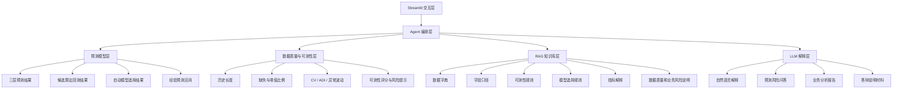

# OMS 动销预测智能分析 Agent 扩展设计

## 1. 当前 V1 系统能力与局限

当前 V1 是一个面向 OMS 动销预测与可测性分析的 Streamlit 应用，核心能力集中在“读取本地汇总数据、按业务层级生成时间序列预测、滚动回测、自动模型选择和可测性解释”。

### 1.1 已具备能力

V1 已支持以下能力：

- Streamlit 筛选与结果展示界面；
- 渠道大类、渠道细分类、渠道型号三层预测；
- 候选预测方法：Naive、移动平均、SES、Holt、线性回归、Seasonal Naive、Random Forest、Croston SBA；
- Walk-Forward 滚动回测；
- WAPE、sMAPE、MAE、Bias 等误差指标；
- 基于回测结果的自动模型选择；
- 可测性评分、风险提示和经验预测区间；
- 对历史长度不足、零值比例较高、波动较大、疑似最新月份不完整等场景给出风险提示；
- 数据库和原始业务数据保持在本地，不进入 GitHub。

### 1.2 当前局限

V1 的重点是预测计算和可测性分析，还不是智能分析 Agent。主要局限包括：

- 解释方式仍以固定规则和页面文案为主，无法针对业务人员的自然语言问题进行灵活问答；
- 用户需要自行阅读多个表格、图形和指标，再综合判断风险；
- 可测性规则、模型选择规则、指标含义等知识尚未形成可检索知识库；
- 当前没有独立的 Agent 编排层，无法把“查询预测、比较算法、提取风险证据、生成报告”串成一个任务流程；
- LLM 尚未接入，因此不能生成自然语言分析简报、答辩口径或交互式解释；
- 缺少对业务口径文档、数据字典、模型规则说明的 RAG 问答能力；
- 当前预测主要依赖历史动销序列，尚未引入节假日、促销、价格、区域、库存、渠道政策等外部解释变量；
- `qty_total` 作为动销目标字段仍需要在最终交付前与业务方确认口径。

## 2. LLM 的职责边界

V2 中引入 LLM 和 Agent 的目标不是替代传统预测模型，而是提升预测结果的解释、问答、报告生成和任务编排能力。

### 2.1 为什么 LLM 不直接生成预测数值

LLM 不应直接生成预测数值，原因如下：

- 预测数值必须可追溯。当前系统的预测值来自明确的时间序列算法、训练数据、回测窗口和模型选择规则，能够被复算和审计。
- LLM 生成数字不具备稳定性。同一个问题在不同提示词或上下文下可能得到不同数值，不适合作为经营预测依据。
- LLM 无法天然保证遵守时间序列约束。例如只使用历史数据预测未来、排除疑似不完整月份、保持回测逻辑一致等，都应由确定性代码完成。
- 预测需要指标验证。WAPE、sMAPE、MAE、Bias、经验预测区间等都必须来自真实回测计算，而不是语言模型推断。
- 业务风险高。预测值会影响备货、库存、销售目标和经营判断，不能由不可复算的文本生成过程直接给出。

### 2.2 LLM 应承担的工作

LLM 在 V2 中只负责以下类型任务：

- 解释：把模型选择、误差指标、风险提示转换为业务人员容易理解的语言；
- 问答：基于 RAG 知识库回答数据口径、指标含义、可测性规则等问题；
- 报告：根据工具返回的预测结果和风险证据生成分析简报；
- 编排：根据用户问题选择应调用的工具，例如先查预测结果，再查候选算法，再生成解释；
- 对比：帮助用户理解不同算法、不同层级、不同渠道或型号之间的差异；
- 提醒：提示数据质量、历史不足、波动过大、零值过高、回测误差偏大等风险。

所有数值结论必须来自预测工具、回测工具或可测性工具的返回结果。LLM 只能组织和解释这些结果，不能自行编造预测值、误差值或业务结论。

## 3. V2 总体架构

V2 建议采用“确定性预测工具 + Agent 编排 + LLM 解释 + RAG 知识库”的分层架构。



### 3.1 预测模型层

预测模型层继续使用 V1 已实现的传统预测方法和回测逻辑。该层负责生成：

- 指定层级、筛选条件和预测周期下的预测结果；
- 每个候选算法的回测表现；
- 自动选择的最佳模型；
- WAPE、sMAPE、MAE、Bias；
- 经验预测区间；
- 模型不适用或降级的原因。

该层输出结构化结果，不输出自由文本判断。

### 3.2 数据质量与可测性层

数据质量与可测性层负责判断“这组数据是否适合预测”。该层应继续沉淀 V1 的可测性能力，包括：

- 历史月份数、有效月份数、缺失月份比例；
- 零动销比例、均值、标准差、CV；
- ADI、非零需求 CV2；
- 异常值比例；
- 季节性强度、趋势强度；
- 最新完整月份；
- 回测窗口数量和误差稳定性；
- 综合可测性评分、等级和风险提示。

该层不替代预测模型，而是为预测结果提供可信度和风险证据。

### 3.3 Agent 编排层

Agent 编排层负责把用户问题拆解为工具调用流程。例如：

- 用户问“下月某渠道型号会卖多少”，Agent 应调用预测结果查询工具；
- 用户问“为什么选这个模型”，Agent 应调用候选算法比较工具；
- 用户问“这个预测靠谱吗”，Agent 应调用可测性证据工具和风险问答工具；
- 用户问“生成一页业务简报”，Agent 应先取预测、回测、风险证据，再调用报告生成工具。

Agent 编排层的关键原则是：先调用工具获得事实，再让 LLM 解释事实。

### 3.4 LLM 解释层

LLM 解释层只接收工具返回的结构化摘要、RAG 检索到的规则说明和用户问题。它负责：

- 用业务语言解释指标；
- 说明模型选择原因；
- 总结主要风险；
- 输出报告段落；
- 帮助用户形成答辩口径。

LLM 解释层不得绕过工具直接访问数据库，也不得自行计算或编造预测数值。

### 3.5 RAG 知识库层

RAG 知识库层负责存放可检索的项目知识和业务规则。LLM 回答规则、口径、指标含义类问题时，应优先从 RAG 检索相关片段，再组织答案。

### 3.6 Streamlit 交互层

Streamlit 交互层继续作为用户入口。V2 可在现有页面基础上增加：

- 智能问答输入框；
- “解释当前结果”按钮；
- “生成预测简报”按钮；
- “查看风险原因”按钮；
- “比较候选算法”按钮；
- Agent 工具调用过程的简要展示。

## 4. Agent 可调用工具设计

以下是 V2 建议封装的工具契约。它们应调用现有预测、回测和可测性逻辑，或调用基于这些逻辑生成的结构化结果。这里描述的是 V2 设计，不表示 V1 已经实现了独立 Agent 工具接口。

### 4.1 查询预测结果

工具名称：`query_forecast_result`

用途：查询指定业务层级、筛选条件和预测周期的预测结果。

输入示例：

```json
{
  "level": "channel_model",
  "channel": "指定渠道大类",
  "channel_subtype": "指定渠道细分类",
  "product_model": "指定型号",
  "horizon": 1
}
```

输出应包含：

- 预测层级；
- 筛选条件；
- 预测月份；
- 点预测值；
- 经验预测区间；
- 最佳模型；
- WAPE、sMAPE、MAE、Bias；
- 回测窗口数量；
- 最新完整月份；
- 是否存在数据完整性风险。

### 4.2 比较候选算法

工具名称：`compare_candidate_models`

用途：返回同一序列下各候选算法的适用性、回测指标和模型选择原因。

输出应包含：

- 候选算法列表；
- 每个算法是否启用；
- 未启用或不适用原因；
- 回测 WAPE、sMAPE、MAE、Bias；
- 主比较指标；
- 最终选择的模型；
- 模型选择解释所需的结构化原因。

### 4.3 获取可测性证据

工具名称：`get_predictability_evidence`

用途：返回当前序列的可测性评分、风险提示和支撑证据。

输出应包含：

- 综合可测性得分和等级；
- 结构质量得分；
- 回测表现得分；
- 历史月份数、缺失比例、零值比例；
- CV、ADI、异常值比例；
- 季节性强度、趋势强度；
- 回测误差稳定性；
- 风险提示列表；
- 风险对应的证据字段。

### 4.4 生成业务分析报告

工具名称：`generate_business_report`

用途：基于预测结果、候选算法比较、可测性证据和 RAG 规则说明生成业务分析报告。

输入必须来自其他工具的返回结果，不允许只凭用户自然语言直接生成报告。

报告建议包含：

- 分析对象和预测月份；
- 核心预测结论；
- 采用模型和选择原因；
- 回测表现；
- 可测性等级；
- 主要风险；
- 建议业务动作；
- 需要人工确认的事项。

### 4.5 回答预测风险问题

工具名称：`answer_forecast_risk_question`

用途：回答“为什么不可靠”“误差高在哪里”“是否适合用于备货”等风险问题。

该工具应组合调用：

- `query_forecast_result`
- `compare_candidate_models`
- `get_predictability_evidence`
- RAG 检索工具

输出应把事实依据和解释分开：

- 事实依据：来自工具返回的数值、等级、规则命中项；
- 解释结论：由 LLM 用业务语言生成；
- 注意事项：明确哪些判断需要业务人员结合外部信息确认。

## 5. RAG 知识库内容设计

RAG 知识库应只存放规则、口径、说明和脱敏文档，不存放原始客户明细、数据库文件或真实业务结果。

建议包含以下文档：

### 5.1 数据字典

说明系统使用的数据表、字段名称和业务含义，例如：

- 时间字段；
- 渠道大类；
- 渠道细分类；
- 型号；
- 品类；
- 细分品类；
- 动销数量字段。

### 5.2 字段口径

说明字段如何被用于预测，例如：

- 当前动销目标字段的定义；
- 月份字段的格式和完整性要求；
- 渠道层级的聚合口径；
- 型号层级的筛选与聚合口径；
- 哪些字段仅用于筛选，哪些字段进入预测序列。

### 5.3 可测性规则

说明可测性评分的组成和含义，例如：

- 历史长度为何影响可测性；
- 缺失比例、零值比例、CV、ADI 的含义；
- 异常值和最新月份不完整对预测的影响；
- 高可测、中可测、低可测的解释边界。

### 5.4 模型选择规则

说明自动模型选择如何工作，例如：

- 候选算法纳入条件；
- Walk-Forward 回测流程；
- WAPE 优先、MAE 兜底、sMAPE 辅助比较的规则；
- 指标接近时优先选择更简单、更稳定模型的原则；
- 历史不足、季节性不足、非零样本不足时的降级逻辑。

### 5.5 指标解释

说明指标如何被业务理解，例如：

- WAPE：整体加权绝对百分比误差；
- sMAPE：对称平均绝对百分比误差；
- MAE：平均绝对误差；
- Bias：整体高估或低估方向；
- 经验预测区间：基于历史回测残差的经验范围，不代表准确率保证。

### 5.6 数据质量和业务风险说明

说明哪些情况会导致预测风险升高，例如：

- 历史数据太短；
- 零动销或间歇性需求明显；
- 最近月份疑似不完整；
- 波动过大或异常值过多；
- 季节性不稳定；
- 新品、冷启动、渠道政策变化；
- 促销、价格、库存、区域等外部因素未进入模型。

## 6. 用户问答示例与工具调用

以下示例展示 V2 Agent 应如何调用真实工具获取事实，再由 LLM 生成解释。示例中的数值不在本文档中虚构，实际回答时必须使用工具返回值。

### 示例一：查询预测值

用户问题：

> 某渠道细分类下某型号下个月预计卖多少？这个数靠谱吗？

Agent 调用顺序：

1. `query_forecast_result`
2. `get_predictability_evidence`
3. `answer_forecast_risk_question`

回答方式：

- 先给出工具返回的预测月份、点预测值和经验预测区间；
- 再说明最佳模型、回测指标和可测性等级；
- 最后列出影响可信度的主要风险，例如历史长度、零值比例、波动性或最新月份完整性。

### 示例二：解释为什么选择某个模型

用户问题：

> 为什么系统没有选 Random Forest，而是选了 Seasonal Naive？

Agent 调用顺序：

1. `compare_candidate_models`
2. RAG 检索“模型选择规则”
3. LLM 解释层生成回答

回答方式：

- 说明每个候选算法是否启用；
- 对比 Random Forest 和 Seasonal Naive 的回测指标；
- 引用模型选择规则解释最终选择原因；
- 如果 Random Forest 因历史长度或非零样本不足未启用，应明确说明这是工具返回的规则命中结果。

### 示例三：生成业务简报

用户问题：

> 帮我生成一段给业务负责人看的预测简报，说明本月重点风险。

Agent 调用顺序：

1. `query_forecast_result`
2. `compare_candidate_models`
3. `get_predictability_evidence`
4. RAG 检索“指标解释”和“数据质量和业务风险说明”
5. `generate_business_report`

回答方式：

- 用业务语言概括预测结论；
- 标明预测数值和指标均来自工具结果；
- 解释误差、偏差和可测性等级；
- 给出风险提示和建议人工确认事项；
- 不输出工具没有返回的具体业务结果。

## 7. 数据安全边界

V2 必须延续并强化当前项目的数据安全要求。

### 7.1 LLM 不直接读取原始客户明细

LLM 不应连接 SQLite 数据库，也不应读取客户明细、交易明细或任何原始业务记录。LLM 只接收工具返回的聚合结果、指标摘要和脱敏解释材料。

### 7.2 LLM 不编造预测值

LLM 不得根据经验、上下文或语言推理生成预测数值。任何预测值、误差指标、可测性分数、区间上下界都必须来自现有预测工具或可测性工具返回结果。

### 7.3 所有数值结论必须可追溯

面向用户展示的数值结论应能追溯到：

- 查询条件；
- 预测层级；
- 历史数据范围；
- 候选算法；
- 回测窗口；
- 模型选择规则；
- 工具返回结果。

### 7.4 数据库和原始数据不进入 GitHub

数据库文件、原始数据、客户明细、真实业务结果、导出的敏感报表都不得提交到 GitHub。文档中只描述设计、规则和脱敏示例，不复制任何真实业务数据。

### 7.5 RAG 只存放脱敏知识

RAG 知识库只能包含数据字典、字段口径、规则说明、指标解释和脱敏业务风险说明。若需要加入案例，应使用匿名化、抽象化案例，不包含客户、渠道、型号的真实敏感结果。

## 8. 分阶段实施计划

### 8.1 V2.1：规则驱动解释助手

目标：在不引入完整 RAG 和工具调用 Agent 的前提下，先基于 V1 已有结构化结果生成固定模板解释。

范围：

- 对最佳模型、回测指标、可测性等级生成自然语言说明；
- 对风险提示生成业务解释；
- 在 Streamlit 页面增加“解释当前结果”区域；
- 不让 LLM 接触数据库或原始明细。

### 8.2 V2.2：RAG 问答

目标：建立项目知识库，让用户可以询问字段口径、指标含义、可测性规则和模型选择规则。

范围：

- 整理数据字典、字段口径、可测性规则、模型选择规则、指标解释；
- 建立向量检索或关键词检索能力；
- 回答规则类问题时显示引用来源；
- 不回答工具结果之外的具体预测数值。

### 8.3 V2.3：工具调用 Agent

目标：让 Agent 能根据用户问题自动选择并调用预测、模型比较和可测性工具。

范围：

- 封装 `query_forecast_result`；
- 封装 `compare_candidate_models`；
- 封装 `get_predictability_evidence`；
- 封装 `answer_forecast_risk_question`；
- 对工具入参、出参和错误处理进行约束；
- 在界面中展示关键工具调用结果，避免黑箱回答。

### 8.4 V2.4：自动生成预测简报

目标：将预测结果、模型选择、可测性证据和风险解释整合成可复用的业务简报。

范围：

- 支持按筛选条件生成单对象简报；
- 支持按渠道或型号批量生成重点风险摘要；
- 支持导出 Markdown 或页面报告；
- 报告中的所有数值来自工具返回；
- 报告末尾列出数据与模型限制。

## 9. 每阶段验收标准

### 9.1 V2.1 验收标准

- 页面能基于当前预测结果生成解释文本；
- 解释文本中的模型名称、指标、可测性等级与页面结果一致；
- 风险提示能对应到已有可测性规则；
- 不出现工具结果之外的预测数值；
- 不读取原始客户明细。

### 9.2 V2.2 验收标准

- 用户可以询问数据字典、字段口径、指标解释、可测性规则和模型选择规则；
- 回答能引用知识库中的对应文档片段；
- 当用户询问具体预测值时，系统应提示需要调用预测工具，而不是由 RAG 或 LLM 直接回答；
- 知识库不包含数据库文件、原始明细或真实业务结果；
- 对无法从知识库回答的问题，系统明确说明缺少依据。

### 9.3 V2.3 验收标准

- Agent 能根据至少三类问题正确选择工具：查预测、问模型选择、问预测风险；
- 工具调用参数与用户筛选条件一致；
- 返回答案中的所有数值均能在工具返回结果中找到；
- 当查询条件不完整时，Agent 能提示用户补充必要筛选项；
- 当工具无结果或数据不足时，Agent 不编造结论，并给出可理解的原因。

### 9.4 V2.4 验收标准

- 系统能生成结构完整的预测简报；
- 简报包含预测结论、模型选择、回测表现、可测性等级、主要风险和人工确认事项；
- 简报中的数值全部来自预测、回测或可测性工具；
- 简报能明确区分事实、解释和建议；
- 支持保存或导出脱敏报告，不导出数据库和原始明细。

## 10. 答辩说明口径

答辩中可以这样说明“LLM + Agent 没有取代传统预测模型，而是提升可解释性和业务交付能力”：

本系统的预测数值仍然由传统预测模型产生，包括 Naive、移动平均、SES、Holt、线性回归、Seasonal Naive、Random Forest 和 Croston SBA。系统通过 Walk-Forward 滚动回测比较候选模型，并使用 WAPE、sMAPE、MAE、Bias 等指标选择最合适的模型。因此，预测结果具有明确的数据来源、算法来源和回测依据。

LLM 不负责生成预测值，也不直接读取原始数据库。LLM 的作用是解释预测结果、回答指标和规则问题、总结风险、生成业务报告，并通过 Agent 编排调用真实预测工具。换句话说，传统模型负责“算得准不准、是否可复算”，Agent 负责“该查什么、按什么流程查”，LLM 负责“把结果讲清楚、把风险说明白”。

这种设计可以保证两点：一方面，核心预测逻辑仍然可控、可验证、可追溯；另一方面，业务人员不需要理解所有算法细节，也能快速知道预测值来自哪里、模型为什么被选择、当前结果有哪些风险、是否适合用于备货或经营判断。LLM + Agent 的价值是提升可解释性、交互效率和交付表达，而不是替代时间序列预测模型本身。
